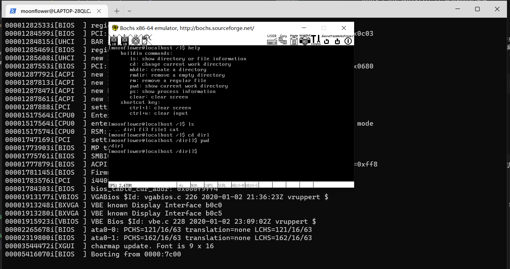

+ ## 文件系统
    参考 linux 0.11 版本的文件系统实现，其中 inode 支持一级间接块查询
    ```
    // inode 结构
    struct inode {
        uint32_t i_no;    // inode 编号
        uint32_t i_size;
        uint32_t i_open_cnts;   // 记录此文件被打开的次数
        bool write_deny;    // 写文件不能并行，进程写文件前检查此标识 

        // i_sectors[0-11] 是直接快，i_sectors[13] 用来存储一级间接块指针
        uint32_t i_sectors[13];
        struct list_elem inode_tag; // 用于加入已打开的 inode 队列
    };
    ```
    目录项定义及相关结构
    ```
    // 目录结构
    struct dir {
        struct inode* inode;
        uint32_t dir_pos; // 记录在目录内的偏移
        uint8_t dir_buf[512]; // 目录的数据缓冲
    };

    // 目录项结构
    struct dir_entry {
        char filename[MAX_FILE_NAME_LEN]; // 普通文件或目录名称
        uint32_t i_no; // 普通文件或目录对应的 inode 编号
        enum file_types f_type; // 文件类型
    };
    ```
    文件属性相关定义
    ```
    // 文件属性结构体
    struct stat {
        uint32_t st_ino; // inode 编号
        uint32_t st_size; // 尺寸
        enum file_types st_filetype; // 文件类型
    };
    ```
    fs.c 中实现文件系统初始化及相关系统调用，dir.c 中实现目录底层操作接口，file.c 中实现文件底层接口。实现细节见代码注释。
+ ## 其它组件
    实现包括：中断管理、线程调度、内存管理、权限管理、管道、终端等。实现细节见代码注释
+ ## 结果展示
    
+ ## 参考文献
    + 操作系统真象还原
    + linux 内核完全注释